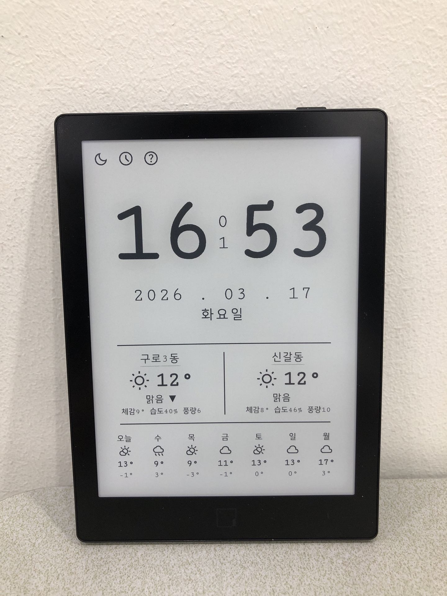
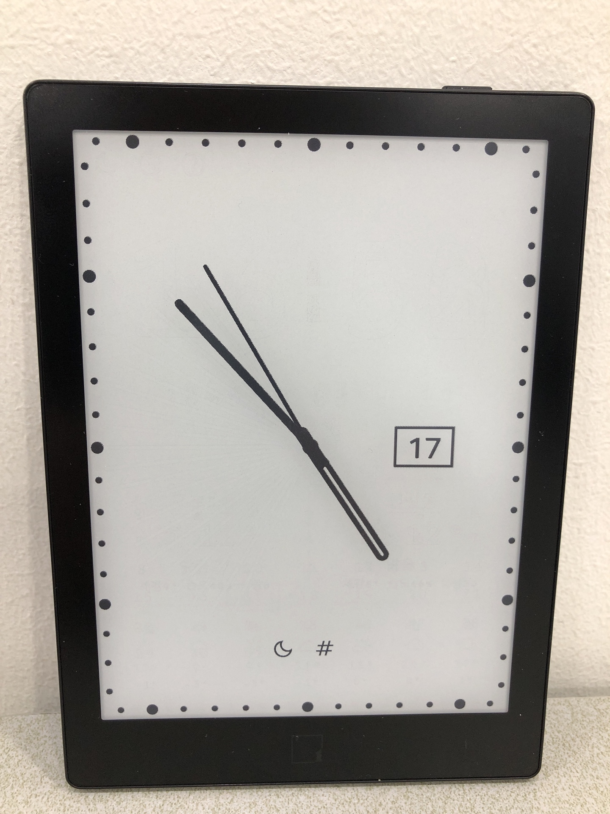
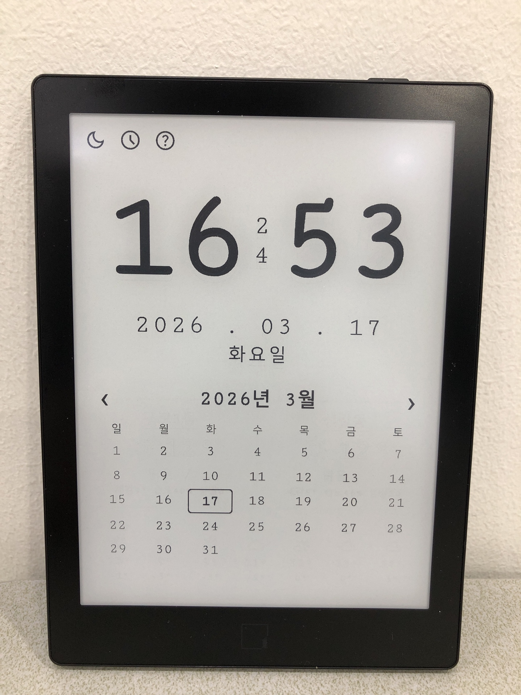

<div align="center">
    <h1>E-Ink Clock</h1>
    
    
</div>

A web-based clock optimized for e-ink displays and e-readers. Supports digital and analog modes with live weather and a built-in calendar — all in a single HTML file, no installation required.


## Usage

Open `index.html` in any browser or e-reader's built-in browser. No server or build step needed.

## Android App

An Android APK is available for e-ink devices such as the **Hisense Luna X** and other e-readers running Android 8+.

**Install:**
1. Download the latest `einkclock-vX.X.X.apk` from [GitHub Releases](https://github.com/TypoStudio/einkclock/releases/latest)
2. Enable **Settings → Security → Install unknown apps** on your device
3. Tap the downloaded APK to install

The app loads the clock locally (no network required for the clock itself) and requests location permission for weather.

**Build from source:**
```bash
bash scripts/build-android-local.sh         # debug APK
bash scripts/build-android-local.sh release # release APK
```
Requires Gradle or Android Studio. The script copies `index.html` into assets automatically.

## Features

### Clock
- Digital mode — large time display with date and day of week
- Analog mode — 12 clock face styles (circle, rectangle, fullscreen)
- Analog mode — tap the center to cycle 6 hand configurations (see below)
- Double-tap anywhere to toggle fullscreen

### Weather
- Current weather for 2 configurable locations
- Shows temperature, feels-like, humidity, and wind speed
- 7-day forecast (switchable between locations)
- Tap a location name to search and change it
- Tap the weekly forecast area to refresh weather data immediately
- Data from [Open-Meteo](https://open-meteo.com/) — no API key required

### Calendar



- Tap the date to open a monthly calendar
- Navigate months with ‹ / › buttons
- Tap the date again to return to weather view

### Display
- Dark / Light mode toggle (auto-selects based on time of day)
- Settings persisted in `localStorage`

## Controls

### Buttons (top-left)

| Button | Action |
|--------|--------|
| ☀ / 🌙 | Toggle dark / light mode |
| 🕐 / # | Switch digital ↔ analog mode |
| ? | Show help (digital mode only) |

### Gestures

| Gesture | Action |
|---------|--------|
| Double-tap | Toggle fullscreen |
| Tap date | Open / close calendar |
| Tap location name | Search and change location |
| Tap ▼ under weather | Select weekly forecast location |
| Tap weekly forecast area | Refresh weather data immediately |

### Analog Mode

Single-tap the clock face to cycle through 12 styles. Double-tap to toggle fullscreen. Tap the **center** to cycle hand configurations:

| # | Hand Mode |
|---|-----------|
| 0 | Hour + Minute + Second hands |
| 1 | Hour + Minute hands |
| 2 | Hour hand only (extended to tick marks) |
| 3 | Inverted sector between hour and minute hands |
| 4 | Inverted semicircle (rotates with hour hand, ticks auto-invert) |
| 5 | Conic gradient (elapsed time fades toward current hour) |

| Style | Shape | Tick Type |
|-------|-------|-----------|
| 0 | Circle | None |
| 1 | Circle | 4-division lines |
| 2 | Circle | 12-division lines |
| 3 | Circle | 60 lines |
| 4 | Circle | 60 dots |
| 5 | Rectangle | 60 lines (angle-based) |
| 6 | Rectangle | 60 dots (angle-based) |
| 7 | Rectangle | 60 dots (uniform) |
| 8 | Fullscreen | 60 lines (uniform) |
| 9 | Fullscreen | 60 lines (angle-based) |
| 10 | Fullscreen | 60 dots (angle-based) |
| 11 | Fullscreen | 60 dots (uniform) |

## Requirements

- Any modern browser with JavaScript enabled
- Internet connection for weather data (Open-Meteo API) and location search (Nominatim)

## License

Copyright (c) 2026 TypoStudio (typ0s2d10@gmail.com)

E-Ink Clock is available under the [GNU General Public License v3.0](LICENSE).

<a href="https://www.buymeacoffee.com/typ0s2d10" target="_blank"></a>

---

## 한국어

전자책 리더(e-ink 디스플레이)에 최적화된 웹 시계입니다. 디지털·아날로그 모드, 실시간 날씨, 달력을 단일 HTML 파일로 제공합니다. 설치 없이 바로 사용할 수 있습니다.

### 사용법

`index.html`을 브라우저나 전자책 리더의 내장 브라우저로 열면 됩니다. 서버나 빌드 과정이 필요 없습니다.

### Android 앱 설치

**Hisense Luna X** 등 Android 8+ e-ink 단말기용 APK를 제공합니다.

**설치 방법:**
1. [GitHub Releases](https://github.com/TypoStudio/einkclock/releases/latest)에서 최신 `einkclock-vX.X.X.apk` 다운로드
2. **설정 → 보안 → 알 수 없는 앱 설치** 허용
3. 다운로드한 APK 파일을 터치하여 설치

앱은 `index.html`을 로컬에서 로드하므로 시계 표시에 네트워크가 필요 없으며, 날씨 기능 사용 시 위치 권한을 요청합니다.

**소스에서 직접 빌드:**
```bash
bash scripts/build-android-local.sh         # 디버그 APK
bash scripts/build-android-local.sh release # 릴리즈 APK
```
Gradle 또는 Android Studio가 필요합니다. 스크립트가 `index.html`을 assets에 자동으로 복사합니다.

### 주요 기능

- **시계** — 디지털 모드(시각·날짜·요일 표시)와 아날로그 모드(12가지 페이스 스타일) 지원
- **아날로그 바늘** — 중앙 터치로 6가지 바늘 구성 순환 (아래 표 참고)
- **날씨** — 2개 지역의 현재 날씨 및 7일 예보, API 키 불필요, 주간 예보 터치로 즉시 갱신
- **달력** — 날짜를 터치해 월간 달력 열기, ‹ / › 로 월 이동
- **화면 모드** — 다크/라이트 모드 전환, 더블탭 전체화면
- **설정 저장** — 위치·모드·아날로그 스타일·바늘 구성이 `localStorage`에 저장됨

### 조작법

#### 버튼 (화면 왼쪽 상단)

| 버튼 | 동작 |
|------|------|
| ☀ / 🌙 | 다크 / 라이트 모드 전환 |
| 🕐 / # | 디지털 ↔ 아날로그 모드 전환 |
| ? | 도움말 표시 (디지털 모드 전용) |

#### 터치 제스처

| 제스처 | 동작 |
|--------|------|
| 두 번 연속 터치 | 전체화면 전환 |
| 날짜 터치 | 달력 열기 / 닫기 |
| 지역명 터치 | 날씨 지역 검색 및 변경 |
| 날씨 설명 아래 ▼ 터치 | 주간 예보 지역 선택 |
| 주간 예보 영역 터치 | 날씨 즉시 갱신 |

#### 아날로그 모드

시계를 한 번 터치할 때마다 스타일이 순서대로 바뀝니다. 두 번 연속 터치하면 전체화면으로 전환됩니다. 시계 **중앙**을 터치하면 바늘 구성이 순환합니다:

| # | 바늘 구성 |
|---|-----------|
| 0 | 시·분·초침 |
| 1 | 시·분침 |
| 2 | 시침만 (눈금까지 확장) |
| 3 | 시·분침 사이 영역 반전 |
| 4 | 반원 반전 (시침 방향 회전, 눈금·날짜 자동 반전) |
| 5 | 코닉 그라데이션 (현재 시각까지 경과 시간 표시) |

| 번호 | 형태 | 눈금 |
|------|------|------|
| 0 | 원형 | 없음 |
| 1 | 원형 | 4분할 선 |
| 2 | 원형 | 12분할 선 |
| 3 | 원형 | 60선 |
| 4 | 원형 | 60점 |
| 5 | 사각형 | 60선 (각도 기준) |
| 6 | 사각형 | 60점 (각도 기준) |
| 7 | 사각형 | 60점 (균등 배치) |
| 8 | 전체화면 | 60선 (균등 배치) |
| 9 | 전체화면 | 60선 (각도 기준) |
| 10 | 전체화면 | 60점 (각도 기준) |
| 11 | 전체화면 | 60점 (균등 배치) |

### 요구 사항

- JavaScript가 활성화된 브라우저
- 날씨 데이터(Open-Meteo) 및 위치 검색(Nominatim) 사용 시 인터넷 연결 필요
